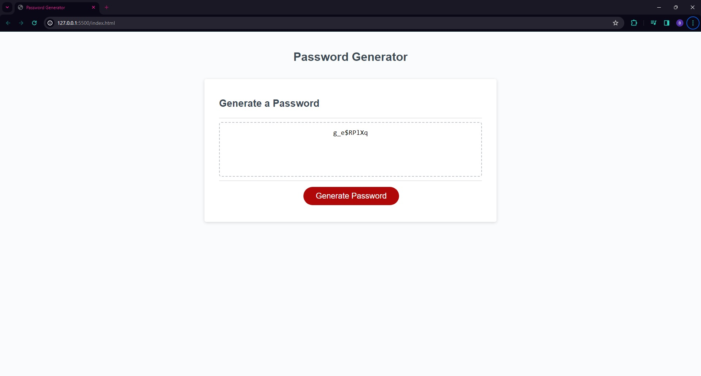

# Refactoring-JavaScript

# project description
In this project I used 
window.prompt, window.alert, and window.confirm to allow the user to choose the critera that makes up their randomly generated password.

# Technology used 
I was given the HTML, and CSS layout to start. I had to write the JavaScript code to meet the requirements of the project.

# Link to the project 

